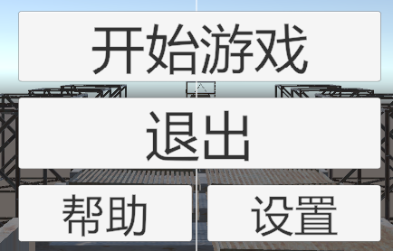
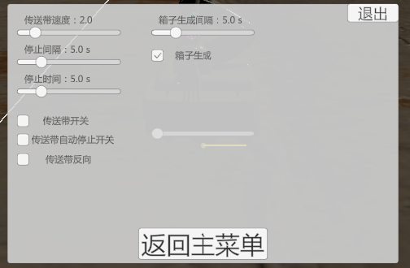
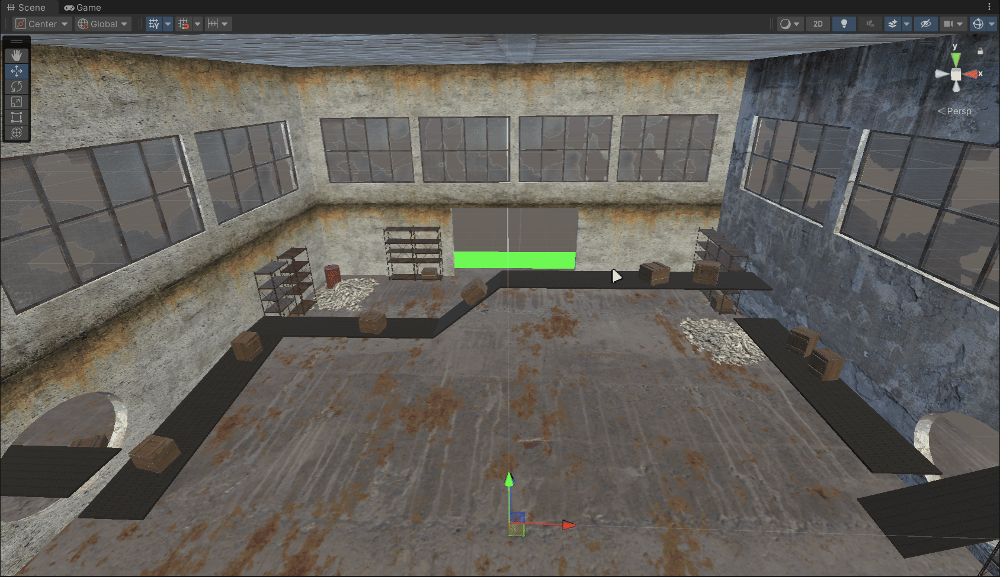

# 个人工作记录

## 总结 

1、使用TextMeshPro组件重构开始菜单并制作设置菜单，适配多种分辨率以及宽高比，优化了字体显示效果，优化菜单切换逻辑；设置菜单中统一控制传送带速度与方向以及箱子生成等相关参数。

 

 

2、制作具有视觉效果的传送带，实现物体仿真运动，并可进行多个传送带接力传递，搭建了EasyScene中的传送带场景；传送带具有停止间隔和时间可控的启停功能。

 

3、修复长期存在的光照异常问题

4、搭建提供版本控制以及文件同步的本地git服务器。

### 2026/6/16
- 修复由开始菜单进入游戏画面发黄问题
### 2026/6/5
- 制作控制菜单，可统一控制箱子生成和传送带参数
- 优化菜单逻辑
- 修复字体异常问题
### 2026/5/22
- 优化传送带视觉效果和箱子运动
- 布置EasySence中传送带
- 实现传送带自动启停，可控制停止时间和间隔

### 2026/5/8
- 搭建传送带 

### 2026/4/17 
- 使用easytier搭建异地局域网，实现小组内部git服务器
### 2026/4/10
- 重新布局菜单，优化ui逻辑
- 解决字体显示模糊异常的问题
### 2026/4/3
- 熟悉unity菜单界面以及基础操作
- 学习C#语法，了解脚本的作用
### 2026/3/27 
- unity软件安装
- 讨论后初步确定玩法
