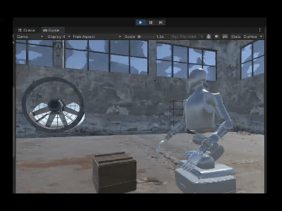
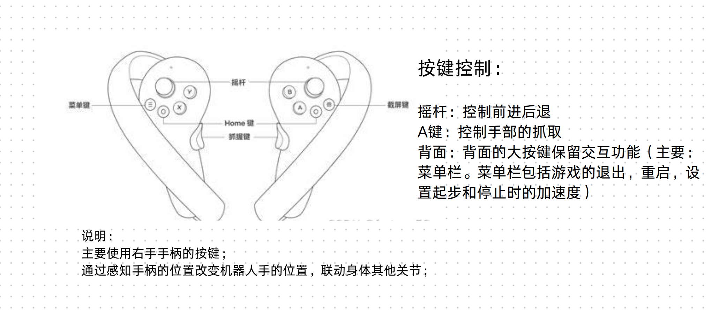
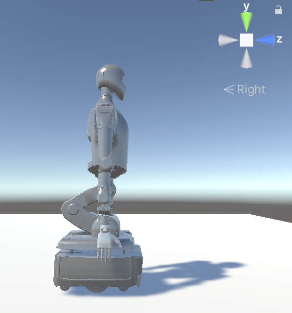

## 2026.4.4-4.10

### 已完成

1. 机器人稳定直立
   通过关节补偿解决了运行后机器人向前倾倒的问题，使机器人在静止和运动过程中实现稳定直立。

2. 机器人手部抓取动作
   采取物理锁定，消除了抓取过程中的抖动。
   按G抓取，按O松开。
   

3. 机器人移动
   按W控制机器人移动，松开逐渐停止。
   

4. 机器人运动学控制
   tab切换滑动条的手动模式和ik模式。
   ujikol分别控制xyz的+-
   
   
   

5. 将场景导入VR并配置手柄的移动旋转 

### 正在进行

   按键映射，游戏内容整合和优化，异常情况处理

   按键映射指南：
   -  

## 2026.3.28-4.3

### 已完成

1. 多难度环境搭建
   搭建两种初始场景：搭建不同2种难度的初始场景（主要是改变货架位置和地面上其他物品的位置），并在初始动画最后提供ui界面以修改难度。
   **EasyScene**
   
   **NormalScene**
   

2. 得分区的设定
   通过脚本判定箱子落入该区域，对应增加血量在页面中显示

3. 用户指引的ui搭建
   游戏开始时，用文字的形式在页面上给用户介绍游戏背景，规则和操作方法。在游戏正式开始后，操作方法放在页面合适位置。

4. 部署随机放箱子脚本
   在上述两种初始场景中，部署之前完成的在地板上随机放箱子的脚本。注意物体不要重叠。

5. 导入机器人模型
   北京人形机器人创新中心有限公司-天轶2.0
   -  

6. 整理资产

### 正在进行

   机器人控制和VR导入

### 有用的资料
[Unity+pico4开发，包含按键设置](https://blog.csdn.net/weixin_44935602/article/details/135238417?fromshare=blogdetail&sharetype=blogdetail&sharerId=135238417&sharerefer=PC&sharesource=smartorange_123&sharefrom=from_link)
[使用模拟器测试 PICO VR 项目](https://www.bilibili.com/video/BV1iu4y1W7zt/?share_source=copy_web&vd_source=18e2999a8a6d4ca3b918b9c1aef8ed49)

## 2026.3.20-27

### 已完成

1. 大体确认了游戏玩法

   **机器人小偷**

   背景：
   在末世无人看守的工厂，进去偷物资偷得越多越好，一次可以拿多个箱子，但是箱子数目越多行动速度会越慢，而且箱子堆太高视野也会受限。箱子的位置和大小不一样，拿取的难度也不一样。成功拿到箱子并安全出门，一个箱子增加一点体力（补给成功）
   限制：
   时间限制（120s），房间里有巡查的地鼠，不能踩到，踩到会扣体力。箱子落地后会惊动地鼠向主角靠近。
   关卡设置：
   每关地鼠数量不一样；房间箱子的位置也不一样；机器人（“我”）出发的位置一样。
   主角：
   a. 机器人模式（被攻击会更安全，碰到地鼠扣的体力更少，但是需要手动操作前进后退等关节运动，对标插花项目的手动模式）
   b. 人类模式（手柄控制，开发阶段就用键盘控制，只关心手的位置不关心具体操作。记录手的运动曲线，训练机器人自主抓握，对标插花项目的自动模式）

2. 完成了环境的搭建（包括音效的配置和箱子位置随机初始化）
   
   

### 正在进行

场景和玩法的进一步优化

