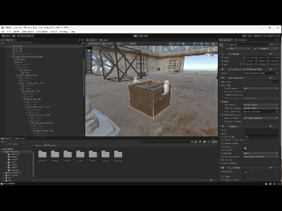
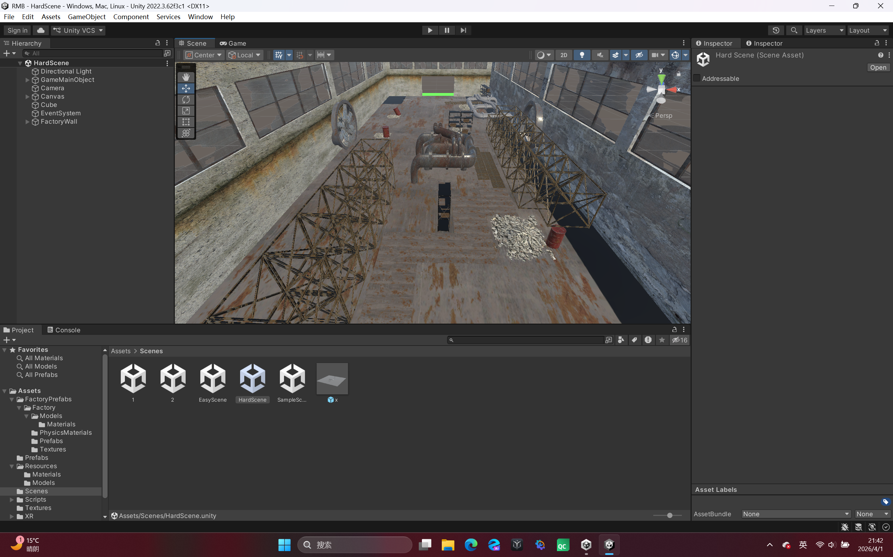
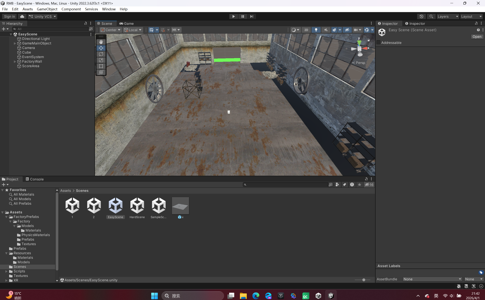

2026.5.8
整合手部动作至最新版本。在feature/hand分支优化了手部抓取稳定性，修改了抓取脚本和抓握测试脚本，增加抓握角度平滑插值和可调抓握速度，增加抓握力分级增强逻辑；添加了抓握检测功能，终端打印箱子是否成功抓住。

2026.4.17
本周改进了抓取逻辑，舍弃了Fixedjoint，纯靠摩擦力进行抓取。已在旧版本上（由于旧版本机器人手臂关节固定，故单独以手部进行演示）完成初步验证，但在拿住箱子后机器人有轻微向右转向的抖动，下周将改善抖动情况并将新脚本整合到团队目前最新版项目中。

2026.4.10
本周完成了五指灵巧手机器人手指抓握箱子的脚本。
目前抓取逻辑采用物理锁定FixedJoint，在左右手掌心各设置了PalmCenter，当PalmCenter靠近箱子时，系统会动态在该物体上添加一个FixedJoint并将其连接至手掌，执行松开指令时，优先销毁 FixedJoint 恢复物体自由，随后手指张开。按G抓取，按O松开。后期需要优化逻辑，添加接触反馈、力位混合控制、靠摩擦力真正实现抓住抓稳箱子。

2026.4.3
本周完成了游戏两个难度的场景搭建。
详细说明：两个场景位于Scenes目录下（EasyScene和HardScene），做场景的时候额外导入了新的工厂厂房的素材，命名为FactoryPrefabs，在每个场景里用到的工厂厂房素材位于FactoryWall下（如果不想要厂房外观直接delete这个就行）。简单场景几乎不设障碍物，出生点位于工厂中心，货架靠近出口；困难场景设障碍，出生点位于工厂门口，货架分散；得分区为出口绿色平台。

2026.3.26
本周熟悉了格物插花项目和unity基本操作
完成了地鼠模型素材导入，找到地鼠冒出、箱子放置等音效。

