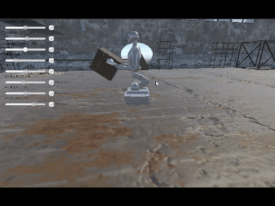
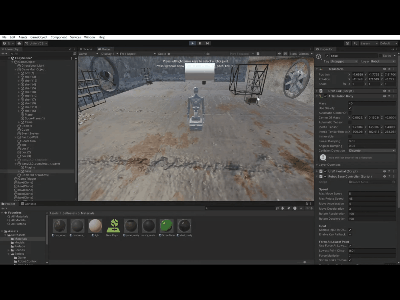
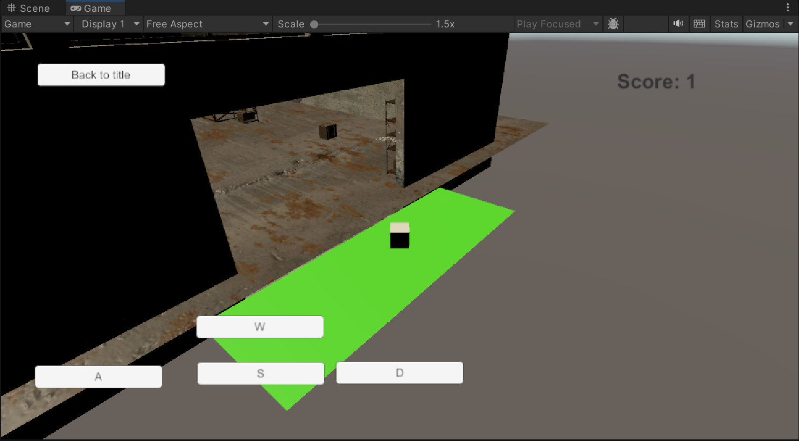

2026.6.16
移除关节 UI 冗余 Revolute 勾选框；机器人可正常制作 Prefab，Console Missing Script 报错消失，关节控制界面更简洁。

2026.6.5
新增 GameTimerManager，在 GameHUD 显示关卡计时（Time: MM:SS）；进入游戏场景自动开始，返回主菜单停止。

2026.5.29
推进机器人 Prefab 化，清理丢失脚本空组件；优化 LoadingManager 进度划分与 GoalZone 查找逻辑，提升 EasyScene 加载速度。

2026.5.22
实现 BoxController 多条件自动清理箱子（落地、低于高度阈值销毁，GoalZone 内保护不删），避免箱子堆积影响性能。

2026.4.17
在底盘移动方案基础上，继续优化移动参数与稳定性。

2026.4.10
在 Articulation Body 机器人上实现与 PID 协同的底盘移动（RobotBaseController），对接 UIInputController 支持键盘与摇杆。

2026.4.3
编写 GoalZone 终点检测脚本，实现箱子入区得分，并与 ScoreManager、HUD 分数显示联动。

2026.3.27
熟悉格物插花项目和 Unity 基本操作。
